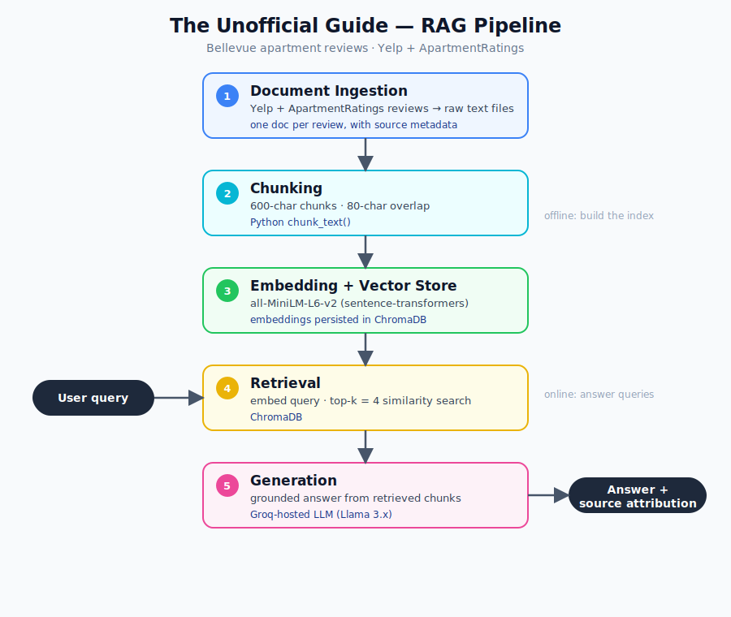

# Project 1 Planning: The Unofficial Guide

> Write this document before you write any pipeline code.
> Your spec and architecture diagram are what you'll use to direct AI tools (Claude, Copilot, etc.) to generate your implementation — the more specific they are, the more useful the generated code will be.
> Update the Retrieval Approach and Chunking Strategy sections if you change your approach during implementation.
> Update this file before starting any stretch features.

---

## Domain
I chose to focus on apartment reviews in Bellevue. This information is valuable to prospective renters and is difficult to conosolidate in one place — in particular, comparing different complexes against one another and weighing the pros and cons based on the user's priorities and requirements.

---

## Documents

| # | Source | Description | URL or location |
|---|--------|-------------|-----------------|
| 1 | Yelp | The Bravern - Will M. Kirkland, WA |  https://www.yelp.com/biz/the-bravern-bellevue-3?hrid=952Sl-mBTebdt9DQUCYDwA&utm_campaign=www_review_share_popup&utm_medium=copy_link&utm_source=(direct) |
| 2 | Yelp | The Bravern - Emily W. Portland, OR | https://www.yelp.com/biz/the-bravern-bellevue-3?hrid=M0LTE7Ji1mPESnvHTUUxuw&utm_campaign=www_review_share_popup&utm_medium=copy_link&utm_source=(direct) |
| 3 | Yelp | Metro 112 -  Vivian H. Bellevue, WA | https://www.yelp.com/biz/metro-112-apartments-bellevue-4?hrid=JpHLoiY3v0Vakt1lf2nvtw&utm_campaign=www_review_share_popup&utm_medium=copy_link&utm_source=(direct) |
| 4 | Yelp | Metro 112 - Summer C. Bellevue, WA | https://www.yelp.com/biz/metro-112-apartments-bellevue-4?hrid=6xoAaLw8aVR62Mf1Nw9vYA&utm_campaign=www_review_share_popup&utm_medium=copy_link&utm_source=(direct) |
| 5 | Yelp | Surrey on the Main - Utopi D. San Francisco, CA | https://www.yelp.com/biz/surrey-on-main-apartments-bellevue?hrid=gCj2ND_MwHsOUgDxNlXoXQ&utm_campaign=www_review_share_popup&utm_medium=copy_link&utm_source=(direct)|
| 6 | Yelp | Meydenbauer Avalon Lorraine I. Los Angeles, CA | https://www.yelp.com/biz/avalon-meydenbauer-bellevue?hrid=8D4rcnqa4bw0E83gNjzQ9Q&utm_campaign=www_review_share_popup&utm_medium=copy_link&utm_source=(direct) 
| 7 | Yelp | Meydenbauer Avalon, Pratik W. Seattle, WA | https://www.yelp.com/biz/avalon-meydenbauer-bellevue?hrid=rCUQAUUM5pTDCPA9ObIsRg&utm_campaign=www_review_share_popup&utm_medium=copy_link&utm_source=(direct) |
| 8 | ApartmentRatings | Meydenbauer Avalon, Current Resident 154444 Resident • 2013 | https://www.apartmentratings.com/wa/bellevue/avalon-meydenbauer_866450118798004/ |
| 9 | ApartmentRatings | Meydenbauer Avalon, Current Resident 392713 Resident • 2008 - 2011 | https://www.apartmentratings.com/wa/bellevue/avalon-meydenbauer_866450118798004/?page=2 |
| 10 | ApartmentRatings | Meydenbauer Avalon, livinginrent Resident • 2009-2010 | https://www.apartmentratings.com/wa/bellevue/avalon-meydenbauer_866450118798004/?page=2#ratingsReviews |

---

## Chunking Strategy

**Chunk size:** 600 characters (~130–150 tokens)

**Overlap:** 80 characters (~20 tokens)

**Reasoning:** The corpus is made up of apartment reviews that vary widely in length — some Yelp and ApartmentRatings entries are a single short paragraph, while others run several paragraphs covering distinct topics (parking, management, noise, amenities). A 600-character chunk is large enough to keep one complete thought or a short review intact in a single chunk, so the embedding captures a coherent opinion rather than a sentence fragment, but small enough that a longer review gets split into a few focused chunks instead of one diluted vector that blends unrelated complaints and praise. This keeps each embedding semantically tight, which improves retrieval precision when a query targets a specific concern (e.g., "is parking a problem?").

The 80-character (~20-token) overlap exists because reviewers often state a topic and then qualify it across a sentence boundary (e.g., "Management is responsive. They fixed my heater the same day."). Without overlap, a hard split could land between the claim and its supporting detail, leaving each chunk only half the context. The overlap carries the trailing sentence(s) of one chunk into the start of the next so a key point isn't stranded on a boundary. At ~13% of chunk size, the overlap is enough to preserve cross-boundary context without creating excessive duplicate text that would inflate the index and surface near-identical chunks in the top-k results.

---

## Retrieval Approach

**Embedding model:** `all-MiniLM-L6-v2` via `sentence-transformers` (384-dimensional embeddings). It's small, fast, runs locally with no API cost, and is a strong general-purpose sentence encoder — well-suited to short, opinionated review text where each chunk is a self-contained thought.

**Top-k:** 4. Reviews are short and repetitive, so a single concern (e.g. parking, noise, management) is usually expressed across multiple reviews. Retrieving 4 chunks gives the generator enough corroborating evidence to summarize a consensus and cite more than one source, while staying small enough to avoid padding the prompt with off-topic chunks that dilute the answer.

**Production tradeoff reflection:** If cost weren't a constraint and this were serving real renters, I'd weigh:
- **Accuracy on domain-specific text:** A larger general model like `all-mpnet-base-v2` (768-dim) or a hosted embedding API (e.g. OpenAI `text-embedding-3-large`, Voyage, Cohere) would better capture nuance in mixed praise/complaint reviews and sarcasm, improving retrieval precision at the cost of latency and money.
- **Context length:** MiniLM truncates around 256 tokens, which is fine for my 600-char chunks but would force re-chunking if I ever ingested long-form blog posts or full property descriptions. A model with a longer window would let me chunk more coarsely.
- **Multilingual support:** Bellevue is demographically diverse; some reviews could appear in other languages. A multilingual model (`paraphrase-multilingual-MiniLM-L12-v2`) would handle those without a separate translation step.
- **Latency:** For an interactive chat UI, embedding the user query must feel instant. MiniLM wins here (a few ms locally); a hosted API adds a network round-trip per query. I'd likely keep a small local model for query embedding and reserve a heavier model only if retrieval quality demanded it.

---

## Evaluation Plan

| # | Question | Expected answer |
|---|----------|-----------------|
| 1 | Which review platforms in this corpus have reviews for Avalon Meydenbauer, and how many reviews total? | Two platforms — Yelp (2: Lorraine I., Pratik W.) and ApartmentRatings (3: residents from 2013, 2008–2011, 2009–2010) — for **5 reviews total**. (Verifiable directly from the Documents table; wrong if the system misses a platform or miscounts.) |
| 2 | Do reviewers report parking as a problem at Metro 112 — yes or no? | **Yes.** Vivian H.: the garage security door is "always broken," so non-paying cars get in and aren't towed. Wrong if it answers about a different complex or invents an unquoted claim. |
| 3 | Which complex do reviewers describe as having noise issues — The Bravern or Metro 112? | **Metro 112** — Vivian H.: walls are "incredibly thin (no insulation) and not sound proof," can hear the neighbor's TV from bed. (The Bravern reviews do not report noise.) Wrong if it conflates the two or names a complex whose reviews don't mention noise. |
| 4 | In the Surrey on the Main review (Utopi D.), what specific building feature or issue does the reviewer name? | **Front-office non-responsiveness / miscommunication** — after move-in, the office doesn't make a real effort to reply to residents on non-maintenance issues, citing "prioritization" for delays. Wrong if it returns a vague mood word ("nice," "bad") instead of this named issue, or pulls from another complex. |
| 5 | Which complex(es), if any, do reviews credit with fast or same-day maintenance/repairs? | **The Bravern** — Will M.: maintenance (Mariano, Gene, Shawn) shows up "within 30 minutes" and resolves the problem. (Metro 112 calls its team "responsive" but gives no speed detail.) Wrong if it credits a complex whose reviews never mention repair speed. |
| 6 | (Out-of-corpus control) Which apartments in **Kirkland** do reviewers recommend? | "I don't have information on Kirkland apartments" — the corpus only covers Bellevue complexes. Wrong if the system fabricates a Kirkland answer instead of declining. |

---

## Anticipated Challenges

1. **Source imbalance and thin coverage skewing answers.** Some complexes have several reviews (Avalon Meydenbauer has 5+ across Yelp and ApartmentRatings) while others have only one (Surrey on the Main). Similarity search has no notion of how many independent reviewers back a claim, so a single strongly-worded review can dominate the top-k and the generator may present one person's opinion as a consensus. Mitigation: keep source attribution on every chunk so the answer can say "based on one review," and consider noting reviewer count in the prompt.

2. **Stale and inconsistent review text producing misleading answers.** The ApartmentRatings reviews date back to 2008–2013, and reviews mix factual claims (rent, parking) with subjective tone and occasional sarcasm. A chunk describing 2009 management or pricing could be retrieved for a present-tense question and presented as current. Mitigation: carry the review date into the chunk metadata and instruct the generator to surface the date / hedge on age, rather than answering as if all reviews are current.

3. **Cross-property bleed in retrieval.** Reviews for different complexes use very similar vocabulary ("parking," "responsive management," "noisy"), so a query about one apartment can retrieve semantically-close chunks from a *different* apartment. Mitigation: store the complex name in metadata and either filter on it or require the generator to attribute each statement to the correct property and ignore chunks about other complexes.

---

## Architecture

---

## AI Tool Plan

**Milestone 3 — Ingestion and chunking:**
- **Tool:** Claude (in Claude Code).
- **Input I'll give it:** The *Documents* table (so it knows each review is a separate source with a complex name, reviewer, platform, and date) and the *Chunking Strategy* section (600-char chunks, 80-char overlap, with reasoning).
- **What I expect it to produce:** A `load_documents()` that reads each saved review file into a record carrying its metadata (complex name, source platform, reviewer, date, URL), and a `chunk_text(text, size=600, overlap=80)` that splits on those exact parameters and preserves the source metadata on every chunk.
- **How I'll verify:** Run it on one short review (should stay a single chunk) and one long multi-paragraph review (should split into a few chunks with ~80 chars repeated at each boundary). Assert chunk length ≤ 600, check overlap by eye, and confirm every chunk still has its source metadata attached.

**Milestone 4 — Embedding and retrieval:**
- **Tool:** Claude (in Claude Code).
- **Input I'll give it:** The *Retrieval Approach* section (`all-MiniLM-L6-v2` via sentence-transformers, top-k = 4, ChromaDB) and the chunk records from Milestone 3.
- **What I expect it to produce:** An `embed_and_store()` that encodes all chunks with `all-MiniLM-L6-v2` and persists them in ChromaDB *with* their metadata, plus a `retrieve(query, k=4)` that embeds the query with the same model and returns the top-4 chunks with their similarity scores and source metadata.
- **How I'll verify:** Run my 5 evaluation questions (above) through `retrieve()` and confirm the returned chunks are about the right complex and topic, that scores are sensible (relevant chunks rank above off-topic ones), and that metadata survives round-trip storage — directly testing the "cross-property bleed" risk.

**Milestone 5 — Generation and interface:**
- **Tool:** A **Groq-hosted open model** (e.g. Llama 3.x via the `groq` SDK) as the runtime generation LLM; **Claude** as my coding assistant for writing the code.
- **Input I'll give it:** The *Generation* stage of the architecture diagram (answer grounded **only** in retrieved chunks, with source attribution) and the *Evaluation Plan* / *Anticipated Challenges* sections so it builds in date/source caveats.
- **What I expect it to produce:** A `generate_answer(query, chunks)` that prompts the Groq model to answer using only the retrieved chunks, cite the complex + source for each claim, and say "I don't have enough information" when the chunks don't support an answer — plus a simple interface (CLI or notebook loop) that ties retrieval → generation together.
- **How I'll verify:** Run all 5 evaluation questions end-to-end and check each answer against its Expected answer: claims are grounded in cited chunks, attribution names the correct complex, single-review topics (e.g. Surrey on the Main) are flagged as limited, and an off-corpus question (e.g. "What's the best apartment in Seattle?") triggers the refusal path instead of a hallucination.

---

## Stretch Features (planned before implementation)

All four stretch features build on the core pipeline without changing it; the base `retrieve()` / `ask()` stay intact.

1. **Hybrid search (`hybrid.py`).** Combine lexical **BM25** (`rank_bm25`) with the existing semantic (cosine) retrieval. Both methods score all 28 chunks; each score set is min-max normalized to [0,1] and fused as `hybrid = α·semantic + (1−α)·bm25` (α=0.5). Rationale: reviews contain exact terms (a complex name, "parking," a staff name) where BM25 excels, plus paraphrased concepts where embeddings excel — fusion should catch both. Verify with a 3-query comparison (semantic-only vs BM25-only vs hybrid) in the README.

2. **Chunking-strategy comparison (`chunk_compare.py`).** Compare the current boundary-aware 600/80 strategy against a mechanical fixed-character 300/50 split on the same query set, reporting top-1 distance and whether the answer-bearing content stays intact. Hypothesis: the smaller mechanical split fragments multi-topic reviews and raises distances; the boundary-aware split keeps complete thoughts.

3. **Metadata filtering.** Built into `retrieve()` via ChromaDB `where` on three fields: `complex` (equality), `source_platform` (Yelp / ApartmentRatings equality), and `date_int` (a YYYYMMDD review date parsed from each filename, range-filtered with `$gte`/`$lte`); multiple constraints combine with `$and`. Demonstrate a query with vs without the `complex` filter, and a date-bounded query (e.g. reviews from 2020+ vs before 2015); expose all three as dropdowns and from/to-year sliders in the UI. The date filter also mitigates the "stale reviews" risk from Anticipated Challenges.

4. **Conversational memory (`Conversation` in `query.py`).** Multi-turn chat where a follow-up ("what about noise there?") is rewritten into a standalone query using prior turns before retrieval, so "there" resolves to the previously-discussed complex. Verify with a 2-turn transcript where turn 2 depends on turn 1.
